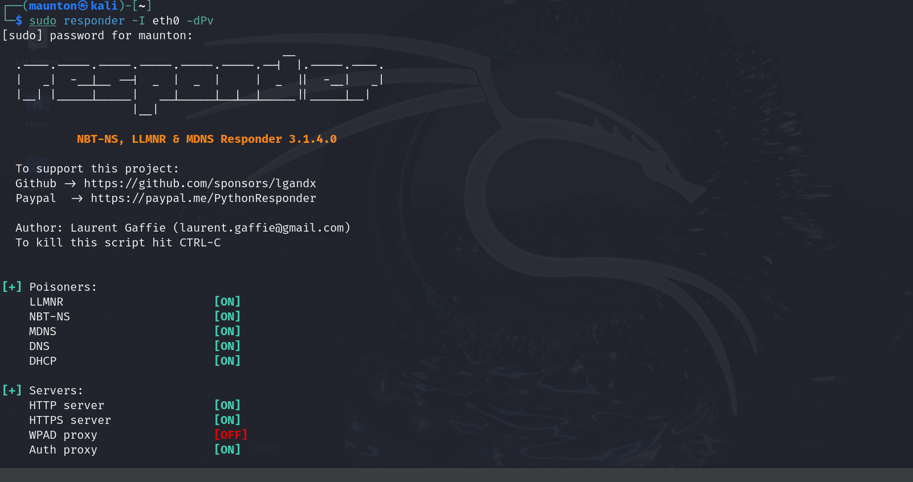
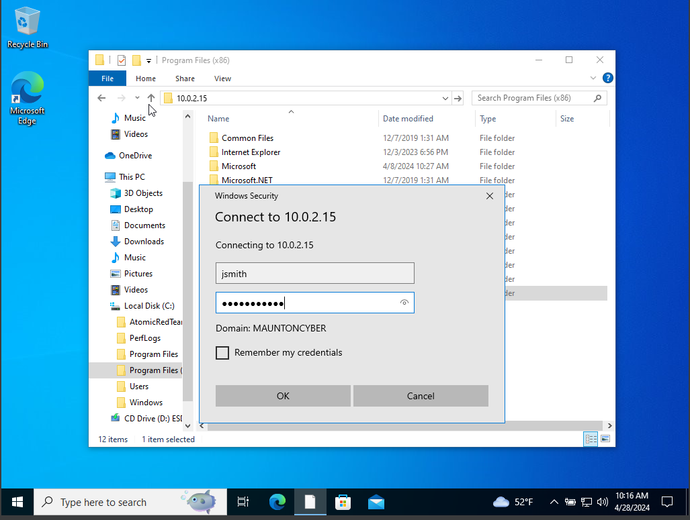
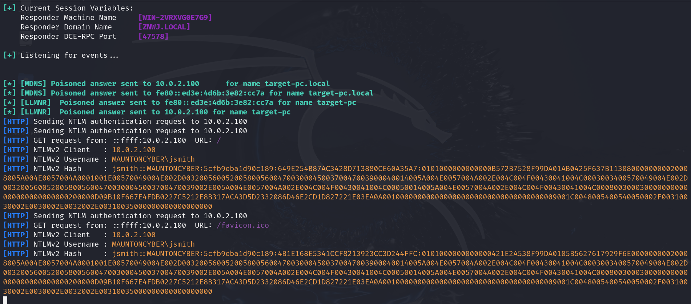
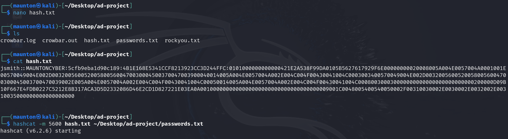
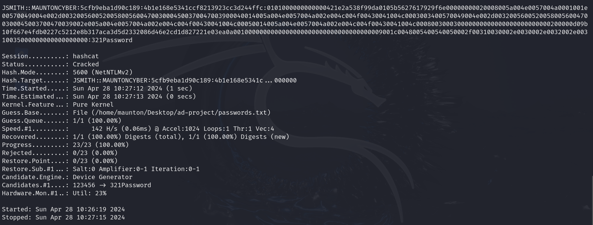
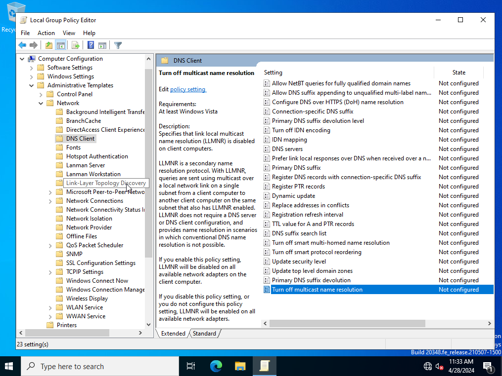
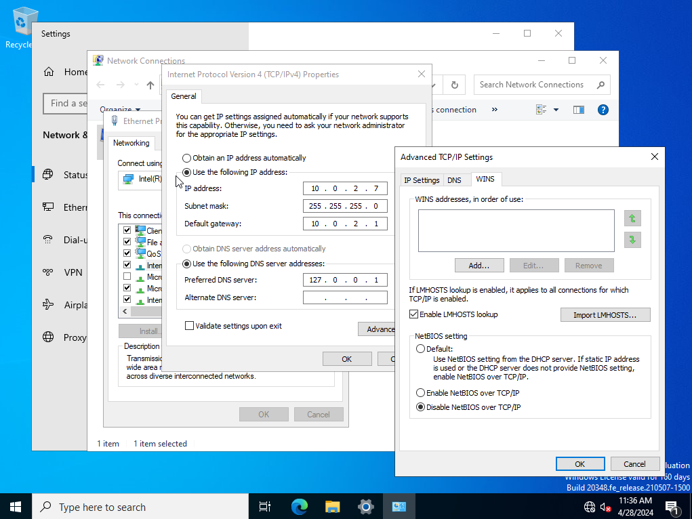

# Active Directory LLMNR Poisoning and Mitigation Lab


This project demonstrates how LLMNR poisoning can be leveraged in an Active Directory lab to capture NTLM authentication material, crack weak credentials, and validate defensive mitigations. The lab highlights both the attack path and the hardening steps used to reduce exposure.

This project demonstrates how LLMNR poisoning can be leveraged in an Active Directory lab to capture NTLM authentication material, crack weak credentials, and validate defensive mitigations. The lab highlights both the attack path and the hardening steps used to reduce exposure.

## Table of Contents

- [Skills Demonstrated](#skills-demonstrated)
- [Tools Used](#tools-used)
- [Lab Environment](#lab-environment)
- [Key Takeaways](#key-takeaways)
- [Disclaimer](#disclaimer)
- [Project Walk-through](#project-walk-through)
- [Attack Workflow](#attack-workflow)
- [Mitigation and Hardening](#mitigation-and-hardening)
- [Why This Matters](#why-this-matters)
- [Project Structure](#project-structure)
- [Future Improvements](#future-improvements)

## Skills Demonstrated

- Active Directory security testing
- Windows host hardening
- Credential attack simulation
- NTLM hash capture and analysis
- Password cracking with Hashcat
- Network attack observation with Responder
- Defensive mitigation validation
- Security documentation and lab reporting

## Tools Used

- Responder
- Hashcat
- Group Policy Management
- Windows Network Adapter Settings
- Kali Linux
- VirtualBox

## Lab Environment

- Windows Server 2022
- Windows 10
- Kali Linux
- Ubuntu Server 22.04
- VirtualBox VM environment

## Key Takeaways

- LLMNR and NetBIOS name resolution can expose Windows environments to credential capture attacks.
- Weak passwords increase the impact of captured NTLM authentication material.
- Disabling multicast name resolution and NetBIOS over TCP/IP significantly reduces this attack surface.
- Security labs should demonstrate both offensive testing and defensive validation.

## Disclaimer

This project was conducted in a controlled lab environment for educational and defensive security purposes only. The techniques shown here should never be used against systems without explicit authorization.

## Project Walk-through

### Network Diagram
<p align="center">
  
</p>

## Attack Workflow

This phase demonstrates how LLMNR poisoning can be used to capture NTLM authentication material from a victim system in a controlled lab environment.

### Responder Command
```bash
sudo responder -I eth0 -dPv
```

### 1. Responder Capture

This screenshot shows Responder actively listening for LLMNR/NBT-NS traffic and preparing to capture authentication attempts from the victim system.

<p align="center">
  
</p>

### 2. Victim Authentication Attempt

This step shows the victim attempting to authenticate, which triggers the poisoned name resolution workflow in the lab.

<p align="center">
  
</p>

### 3. NTLM Hash Capture

Here, the victim's NTLM hash is captured by the attacker system using Responder.

<p align="center">
  
</p>

### Hashcat Command

```bash
hashcat -m 5600 hash.txt ~/Desktop/ad-project/passwords.txt
```

### 4. Hashcat Password Recovery

This screenshot demonstrates the captured hash being cracked with Hashcat to reveal the underlying password.

<p align="center">
  
</p>

## Mitigation and Hardening

### 5. Group Policy Hardening

This image shows the Group Policy setting used to disable multicast name resolution and reduce the risk of LLMNR poisoning.

<p align="center">
  
</p>

### 6. NetBIOS Hardening

This step disables NetBIOS over TCP/IP to further reduce legacy name resolution exposure within the environment.

<p align="center">
  
</p>

### 7. Post-Mitigation Validation

This final screenshot confirms that the mitigation steps were applied and the attack path was reduced or blocked.

<p align="center">
  
</p>

## Why This Matters

Legacy name resolution protocols such as LLMNR and NetBIOS can create unnecessary risk in Windows environments. This lab demonstrates how attackers may abuse these protocols and how defenders can reduce risk through policy and configuration changes.

## Project Structure

```text
.
├── README.md
└── images
    ├── 01-network-diagram.png
    ├── 02-responder-capture.png
    ├── 03-victim-authentication.png
    ├── 04-captured-hash.png
    ├── 05-hashcat-result.png
    ├── 06-group-policy-mitigation.png
    ├── 07-netbios-hardening.png
    └── 08-post-mitigation-validation.png
```

## Future Improvements

- Add Splunk detections for suspicious name resolution activity
- Add Windows event log analysis for authentication events
- Expand the lab to include SMB relay testing
- Document detection logic for blue-team monitoring
